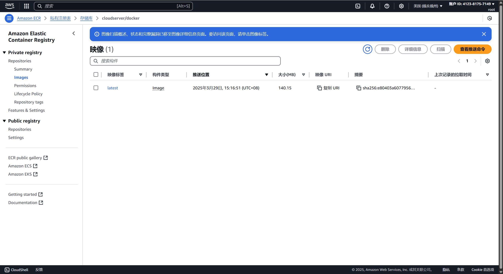

<!-- 文章内容开始 -->
# Docker

## Content

## 基础

### Images && Containers

**Images**: **镜像**是一个只读的模板，用于创建容器。可以基于一个镜像启动多个容器。
**Containers**: **容器**是镜像的一个实例。容器是一个轻量级、可执行的独立软件包，包含运行某个软件所需的所有代码、运行时、系统工具、库和设置。

```shell
# Images
docker pull <image_id_or_name>  # 拉取镜像
docker run -d -p 80:80 <image_id_or_name> # 运行镜像：-d表示后台运行，-p表示端口映射
docker images # 查看镜像
docker images --filter reference=<image_id_or_name> # 查看镜像
docker rmi -f <image_id_or_name>  # 删除镜像：如果镜像正在被使用，则需要加-f强制删除
# Containers
docker containers ls -a # 查看所有容器，包括停止的容器
docker start/stop/rm <container_id_or_name>
docker exec -it <container_id_or_name> bash # 进入容器：-it表示交互式终端
```

## Openai API Proxy

参考仓库：[chatgptProxyAPI](https://github.com/x-dr/chatgptProxyAPI)(已经被Archive了)

使用Cloudflare的方法，在我这里似乎有些问题；所以我就采用了作者不推荐的Docker部署。我没有**VPS(Virtual Private Server)**，所以就同样使用了一年免费的AWS EC2，并在开放端口上做了限制，即用即开。更好的解决方案应该是只对我的IP开放端口，但我没法长期稳定使用一个节点，IP老是变，所以就暂时设的是使用时开放0.0.0.0/0，使用完后关闭。此外还有一个不推荐的原因是**不支持SSE**(Server-Sent Events，实时聊天常用)，原因我也不是很清楚，目前自用好像也没啥问题，所以暂时先不管了。

```shell
# 将容器内3000端口映射到主机的4000端口
# README里都是3000，但我3000被open-webui占用了，所以改成4000
docker run -itd --name openaiproxy \
            -p 4000:3000 \
            --restart=always \
           gindex/openaiproxy:latest

# 使用：
curl --location 'http://[YOUR_SERVER_IP]:4000/proxy/v1/chat/completions' \
--header 'Authorization: Bearer sk-xxxxxxxxxxxxxxx' \
--header 'Content-Type: application/json' \
--data '{
   "model": "gpt-3.5-turbo",
  "messages": [{"role": "user", "content": "Hello!"}]
 }'
```

## AWS Docker Private Registry

### 手动搭建

我在使用国内镜像源下载Open-Webui Docker镜像时，发现速度依然很慢，所以就考虑用AWS在美国的EC2上搭建一个私有Registry，然后国内的阿里云服务器从AWS上拉取镜像。实测，速度比之前镜像快很多，但还是比不上国外直接从Docker Hub拉取的速度。

AWS似乎还提供了[AWS ECR(Elastic Container Registry)](./Docker.md#使用-aws-ecr)服务，也可以直接拿来用。

> 注：以下命令中，我AWS的实际公网ip用`[aws]`替换。

```shell
# 在 AWS EC2 上手动从 Docker Hub 拉取镜像，以hello-world为例
docker pull hello-world

# 运行私有 Registry
docker run -d -p 5000:5000 --name registry registry:2
docker ps # 应看到STATUS为Up的registry容器

# 为hello-world镜像打上标签
docker tag hello-world:latest [aws]:5000/chesszyh987/hello-world:latest

# 检查registry是否能够在另一台主机上访问
curl http://[aws]:5000/v2/_catalog # 如果返回{"repositories":[]}，说明registry正常工作

# 修改配置文件，使用 HTTP 协议连接到你的私有 Registry
sudo vim /etc/docker/daemon.json
# 添加以下选项
{
  "insecure-registries": ["[aws]:5000"]
}
sudo systemctl daemon-reexec    # 重新加载配置文件
sudo systemctl restart docker   # 重启docker服务

# 推送镜像到私有 Registry
docker push [aws]:5000/chesszyh987/hello-world:latest

# 在另一台主机上拉取镜像
docker pull [aws]:5000/chesszyh987/hello-world:latest

# 运行镜像
docker run -d -p 80:80 [aws]:5000/chesszyh987/hello-world:latest # 输出Hello World!
```

### 使用 AWS ECR

接下来，我们将从头开始创建一个Docker镜像，并将其推送到AWS ECR。

#### AWS认证

```shell
# 配置AWS凭证
aws configure
# AWS Access Key ID：AWS 的访问密钥 ID。
# AWS Secret Access Key：AWS 的秘密访问密钥。
# Default region name：设置你使用的区域（比如 us-east-2）。
# Default output format：通常选择 json。

# 登录 AWS ECR
aws ecr get-login-password --region us-east-2 | docker login --username AWS --password-stdin 412381757149.dkr.ecr.us-east-2.amazonaws.com
```

#### 生成Docker镜像

参考资源：[创建容器镜像以在 Amazon ECS 上使用](https://docs.aws.amazon.com/zh_cn/AmazonECS/latest/developerguide/create-container-image.html)和[在 Amazon ECR 中移动映像的整个生命周期](https://docs.aws.amazon.com/zh_cn/AmazonECR/latest/userguide/getting-started-cli.html)

首先，编写Dockerfile文件。

```dockerfile
FROM public.ecr.aws/amazonlinux/amazonlinux:latest  # 使用 Amazon ECR Public 上托管的 Amazon Linux 2 公有映像

# Update installed packages and install Apache
RUN yum update -y && \
 yum install -y httpd

# Write hello world message
RUN echo 'Hello World!' > /var/www/html/index.html

# Configure Apache
RUN echo 'mkdir -p /var/run/httpd' >> /root/run_apache.sh && \
 echo 'mkdir -p /var/lock/httpd' >> /root/run_apache.sh && \
 echo '/usr/sbin/httpd -D FOREGROUND' >> /root/run_apache.sh && \
 chmod 755 /root/run_apache.sh

EXPOSE 80   # Expose port 80 for the web server

CMD /root/run_apache.sh # Start Apache in the foreground
```

然后执行以下命令来构建镜像。

```shell
# 构建镜像
docker build -t hello-world .

# 检查镜像
docker images --filter reference=hello-world

# 运行镜像
docker run -t -i -p 80:80 hello-world # -p 80:80 将容器的80端口映射到主机的80端口
```

访问`http://[aws]:80`，应该能看到Hello World!

#### 推送镜像到AWS

首先通过AWS ECR创建一个存储库，访问Amazon ECR - Private registry - Repositories，或者CLI命令行创建：`aws ecr create-repository --repository-name hello-repository --region region`

其实接下来的步骤跟着AWS的提示走就行了。

```shell
# 给镜像打标签，假设你的AWS账号ID是412381757149，区域是us-east-2，存储库命令空间/命名为cloudserver/docker
docker tag hello-world:latest 412381757149.dkr.ecr.us-east-2.amazonaws.com/cloudserver/docker:latest
# 推送镜像到AWS ECR
docker push 412381757149.dkr.ecr.us-east-2.amazonaws.com/cloudserver/docker:latest
# 清除ECR中的镜像
# aws ecr delete-repository --repository-name cloudserver/docker --region region --force
```

创建后的结果：

#### 从AWS ECR拉取镜像

先决条件：另一台主机也需要安装AWS CLI并配置好凭证。Amazon Linux自带了AWS CLI，但是其他操作系统均需要手动安装。

安装CLI参考：[安装或更新最新版本的 AWS CLI](https://docs.aws.amazon.com/zh_cn/cli/latest/userguide/getting-started-install.html)

```shell
docker pull 412381757149.dkr.ecr.us-east-2.amazonaws.com/cloudserver/docker:latest
```
