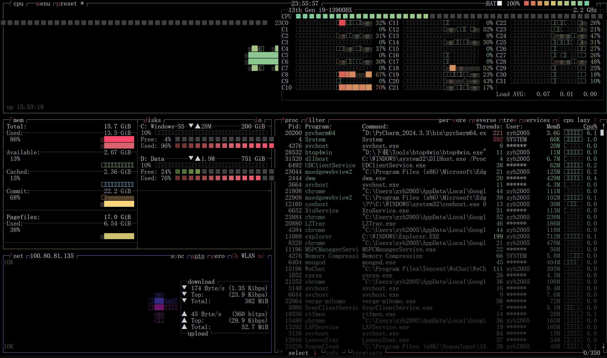

# 2025.3.31 - 2025.4.6

## 4.2

- LLM:
  - [fastapi->mcp](https://github.com/tadata-org/fastapi_mcp)
  - [mcp->api](https://github.com/open-webui/mcpo/)，名为`mcpo`，也是[open-webui](https://github.com/open-webui)的子项目。
- Windows下`htop`的替代：
  - [btop4win](https://github.com/aristocratos/btop4win/releases)
    - 
  - [Sysinternals Suite]()
    - 微软提供的官方工具。

> Sysinternals Suite is a collection of tools from Microsoft which provides detailed information about the processes running on your system, including the handles and DLLs that processes have opened or loaded. It offers a comprehensive overview of system activity, making it an essential tool for troubleshooting and performance monitoring.

- TODO: Pycharm Python开发配置及学习