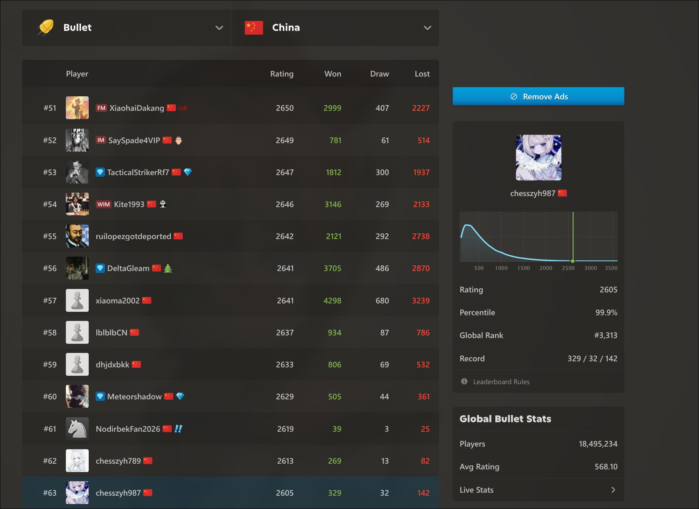
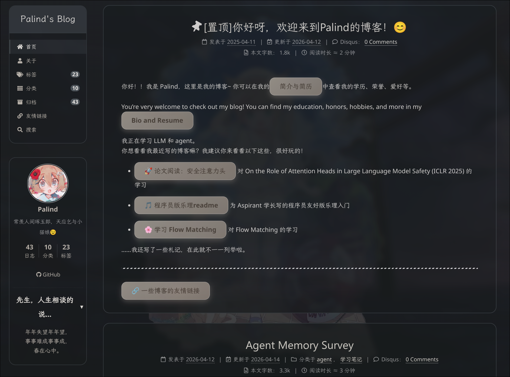
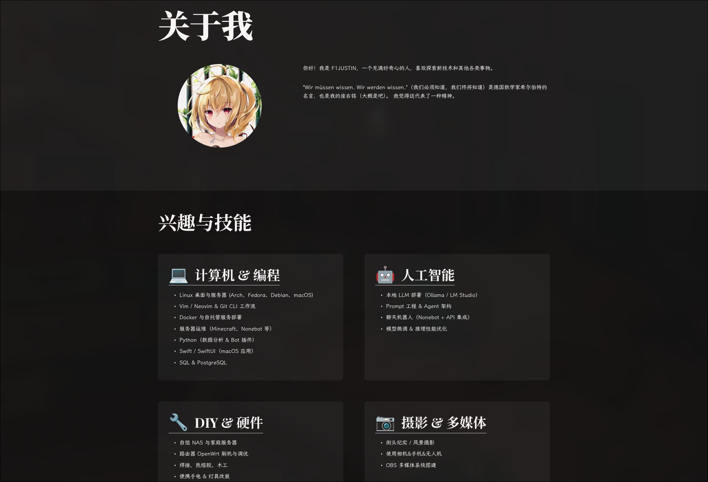

# About Me

## Contact

- Email: `chesszyh987@gmail.com`
- Github: [Chesszyh](https://github.com/Chesszyh)
- Lichess: [Chesszyh](https://lichess.org/@/Chesszyh)

\#62, #63 on [Chess.com](https://chess.com) China bullet leaderboard, global bullet #3313 (2026-06-07)

## Other Sites

- [Report](https://report.chesszyh.xyz): 使用codex/claude-code/gemini-cli等工具解决问题后，使用自定义skill创建的问题报告汇总。
- [Mail](https://mail.chesszyh.xyz): Cloudflare临时邮箱。可以（批量）注册ChatGPT。
- [CLIProxyAPI](https://ai.chesszyh.xyz)：将codex额度共享给朋友的神秘站点，基于Cloudflare Tunnel + [CLIProxyAPI](https://github.com/router-for-me/CLIProxyAPI)。

## Friends(友情链接)

- [Palind's Blog](https://blog.palind-rome.top/)(2026-04-14)

- [F1Justin's Blog](https://f1justin.com/)(2026-06-09)

喵喵啊

## Content

### Plugins

本博客用到的 MkDocs 插件介绍。

### Courses

学校课程的笔记和作业。

笔记目前只有AIGC。

### Posts

零散的技术笔记，这部分基本都是我自己写的，虽然也没什么用。

### Misc

最近探索的内容、个人的状态、不知道该放到什么分类下的博客。

### Thoughts

毫无价值的思考内容，目前依然懒得写。

### Summary

[对大学前两年的失败总结](./summary/2025-08-27.md)

### Duplicated

已废弃的笔记。