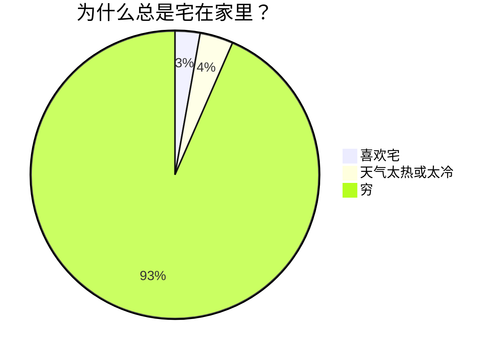
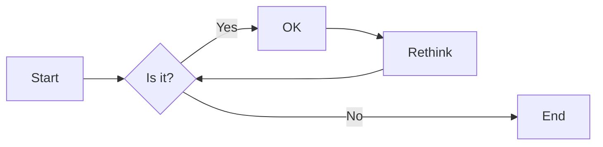
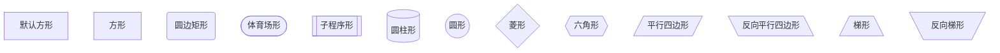
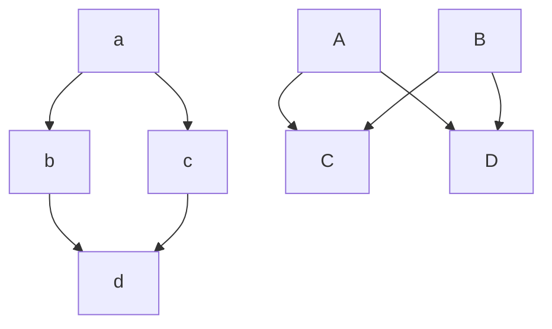

# Mermaid

## 饼状图

## 流程图

- 方向控制：B/T/L/R
    - B: Bottom
    - T: Top
    - L: Left
    - R: Right

- 箭头 
    - 实线箭头：`-->`
    - 粗实线箭头：`==>`
    - 虚线箭头：
        - 无文本：`-.->`
        - 带文本：`-. text .->`

- 无名节点：节点内容不能带空格，有名节点可以

- 节点形状：
    - 方括号 []：方形，默认，表示普通节点
    - 大括号 {}：菱形，表示判断节点
    - 其他形状

- 其他连线(`flowchart`专用)
    - `o--o`
    - `<-->`
    - `x--x`
- 多重连线：`&`，得到笛卡尔积形式

- 子图：`subgraph`，结束时用`end`表示

