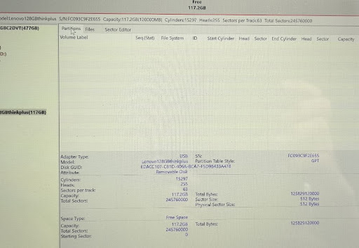
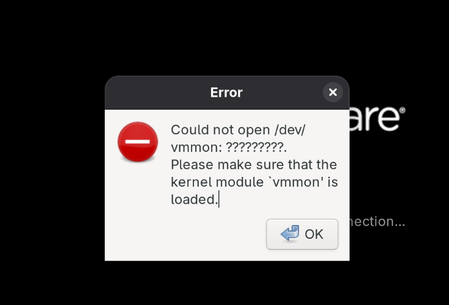

# Note

## Fedora 42

- 基础安装参考博客：https://kinnari-blog.vercel.app/posts/envrionment-setup/
- 美化：参考[我的hyprland配置](https://github.com/Chesszyh/fedora-hyprland-dotfiles)。这是直接跑的[自动化安装脚本](https://github.com/JaKooLit/Fedora-Hyprland)，又进行了一些自定义修改。

### Nvidia

- 需要先关闭secure boot
- 禁用开源驱动，然后安装NVIDIA闭源驱动
- 这期间有概率会出现图形化界面卡死、黑屏等问题，google/AI去吧，怎么解决的我也忘了 :(

### ssh断联

```ini
# file: ~/.ssh/config
TCPKeepAlive yes # IMPORTANT!!
ServerAliveInterval 30
```

## VMWare

VMware Workstation 17.6.4对Linux 6.15.6内核支持稍有问题，安装后初次启动会报错找不到内核头文件：

解决方法：`sudo dnf install kernel-devel-$(uname -r)`

再次启动时依然报错，找不到`driver-config.h`文件。根据[讨论](https://discussion.fedoraproject.org/t/vmware-linux-driverlog-c10-fatal-error-driver-config-h-no-such-file-or-directory/156612/2)指出的相关[Issue](https://github.com/mkubecek/vmware-host-modules/issues/306)，需要下载补丁包并编译安装。`make`, `sudo make install`。补丁包会安装`vmmon`和`vmnet`模块。

安装后可以正常进入VMWare，但是启动虚拟机时(运行时)报错：

原因是Secure Boot禁止了VMWare的内核模块启动。参考[讨论](https://askubuntu.com/questions/1096052/vmware-15-error-on-ubuntu-18-4-could-not-open-dev-vmmon-no-such-file-or-dire)即可。Reboot之后已经能自动找到创建的Key，输入密码之后直接重启即可。

---

Vmware初次配置好后，以后基本就能自动更新和编译模块了。

## 堡垒机

内网和外网的中转服务器，只开放SSH端口。外部用户通过SSH连接堡垒机，堡垒机再通过SSH、RDP等协议连接内网服务器。

个人用的话，其实云服务器+反向SSH隧道就可以了。

## 0728-042

WebShell反弹连接 -- curl下载恶意文件 -- 横向移动，执行其他攻击 -- 失陷主机拔网线，现场取证，人员调度与变更 -- 进一步横向攻击 -- 天翼云主机全部失陷

病毒运行后自删除、加载进内存、横向移动、加载大量网卡（1000多张，可能是因为运行一个pod就增添一张？）、攻击k8s集群
