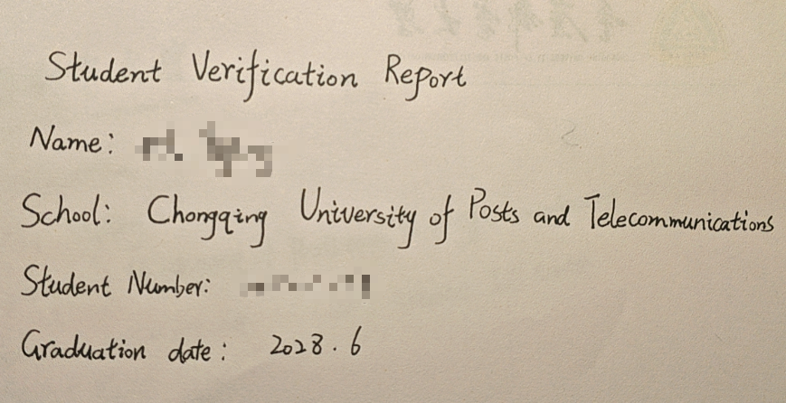

# github学生验证以及代理问题

最近Github一直催促我尽快进行二次验证，否则学生Pro将在14天后被降级。搞笑的是，我申请被拒绝之后，Github居然直接收回了我的Pro，连14天的缓冲期都没了。

还好，多次申请失败之后我及时查阅了中文互联网资料，在2h内把这个糟心事解决了。

## 学生验证无法通过

最关键的问题：即使开VPN、地址定位偏移也没关系，**证明材料选择“其他”，然后使用手写材料，手机拍照即可！！** 参考：[github学生认证失败解决tips（25.1.22） - 愛想笑的文章 - 知乎](https://zhuanlan.zhihu.com/p/19877728956)中的图片：

我拍学生证、校园卡、学信网档案都过不去的原因，大概就是Github利用纯视觉识别技术，无法看清这些材料上面的字，反而手写的字清晰可见。

WHAT STUPID ISSUE.

## 关闭Steam++(现在是[Watt Toolkit](https://github.com/BeyondDimension/SteamTools))之后无法连接到Github

关闭Steam++之后，即使开VPN也无法连接到Github，但能连接到Google，命令行ping github也ping的通。很容易想到是Steam++改了浏览器证书等配置，在Steam++ UI中还原证书、Host配置即可。

