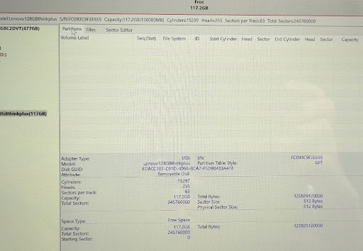

# U盘恢复与格式化

## 分区表损坏U盘的恢复

Link: https://gemini.google.com/app/749ba8d6be7a984c

- U盘：Thinkplus 128G
- 错误表现：插入电脑（Fedora）后无法识别

### 问题分析

具体命令和输出：

- `lsblk -d -o NAME,SIZE,MODEL`: sda 0B 128GB thinkplus
    - 控制器无法正确读取到后端闪存芯片的容量信息
- `sudo dd if=/dev/zero of=/dev/sda bs=1M count=100`: dd: 打开 '/dev/sda' 失败: 找不到介质
    - 操作系统尝试向 /dev/sda 这个设备写入数据（dd写入0），但U盘的控制器返回了一个“没有存储介质”的错误。
- `sudo dmesg | tail -n 30`: 一开始，系统正确识别到了U盘的容量是126GB，但当内核尝试去读写U盘时，U盘的控制器报告说“我准备不好”或“存储介质不存在”(`Sense Key : Not Ready 和 Medium not present`)，随后发生大量的I/O错误，最终U盘的容量被识别为0。

<details>
[ 2238.982202] sd 0:0:0:0: [sda] 245760000 512-byte logical blocks: (126 GB/117 GiB)

[ 2238.982431] sd 0:0:0:0: [sda] Write Protect is off

[ 2238.982441] sd 0:0:0:0: [sda] Mode Sense: 03 00 00 00

[ 2238.982573] sd 0:0:0:0: [sda] No Caching mode page found

[ 2238.982576] sd 0:0:0:0: [sda] Assuming drive cache: write through

[ 2239.028180] sda:

[ 2239.028258] sd 0:0:0:0: [sda] Attached SCSI removable disk

[ 2239.096355] sd 0:0:0:0: [sda] tag#0 FAILED Result: hostbyte=DID_OK driverbyte=DRIVER_OK cmd_age=0s

[ 2239.096368] sd 0:0:0:0: [sda] tag#0 Sense Key : Not Ready [current]

[ 2239.096373] sd 0:0:0:0: [sda] tag#0 Add. Sense: Medium not present

[ 2239.096377] sd 0:0:0:0: [sda] tag#0 CDB: Read(10) 28 00 0e a5 ff 08 00 00 78 00

[ 2239.096380] I/O error, dev sda, sector 245759752 op 0x0:(READ) flags 0x80700 phys_seg 15 prio class 2

[ 2239.096861] sd 0:0:0:0: [sda] tag#0 FAILED Result: hostbyte=DID_OK driverbyte=DRIVER_OK cmd_age=0s

[ 2239.096865] sd 0:0:0:0: [sda] tag#0 Sense Key : Not Ready [current]

[ 2239.096868] sd 0:0:0:0: [sda] tag#0 Add. Sense: Medium not present

[ 2239.096871] sd 0:0:0:0: [sda] tag#0 CDB: Read(10) 28 00 0e a5 ff 88 00 00 38 00

[ 2239.096873] I/O error, dev sda, sector 245759880 op 0x0:(READ) flags 0x80700 phys_seg 7 prio class 2

[ 2239.097245] sd 0:0:0:0: [sda] tag#0 FAILED Result: hostbyte=DID_OK driverbyte=DRIVER_OK cmd_age=0s

[ 2239.097249] sd 0:0:0:0: [sda] tag#0 Sense Key : Not Ready [current]

[ 2239.097253] sd 0:0:0:0: [sda] tag#0 Add. Sense: Medium not present

[ 2239.097256] sd 0:0:0:0: [sda] tag#0 CDB: Read(10) 28 00 0e a5 ff 08 00 00 08 00

[ 2239.097258] I/O error, dev sda, sector 245759752 op 0x0:(READ) flags 0x0 phys_seg 1 prio class 2

[ 2239.097262] Buffer I/O error on dev sda, logical block 30719969, async page read

[ 2239.097708] sd 0:0:0:0: [sda] tag#0 FAILED Result: hostbyte=DID_OK driverbyte=DRIVER_OK cmd_age=0s

[ 2239.097711] sd 0:0:0:0: [sda] tag#0 Sense Key : Not Ready [current]

[ 2239.097715] sd 0:0:0:0: [sda] tag#0 Add. Sense: Medium not present

[ 2239.097717] sd 0:0:0:0: [sda] tag#0 CDB: Read(10) 28 00 0e a5 ff 08 00 00 08 00

[ 2239.097719] I/O error, dev sda, sector 245759752 op 0x0:(READ) flags 0x0 phys_seg 1 prio class 2

[ 2239.097722] Buffer I/O error on dev sda, logical block 30719969, async page read

[ 2239.418344] sda: detected capacity change from 245760000 to 0
</details>

由于我手头没有Windows电脑，尝试VMware win11安装DiskGenius软件修复分区表时，VMware先是识别到了u盘，但当我尝试连接的时候，先提示u盘被宿主机占用，随后这个u盘就直接在VMware里消失了。也就是说，即使是虚拟机，U盘插入之后也得先经过宿主机的USB子系统，否则虚拟机也无法访问到U盘。

### 解决方法

Windows下载DiskGenius软件，插入U盘后，软件可以识别到U盘：

容量识别、设备信息都正常，但是分区表显示“未分配空间 (Unallocated Space)”，说明之前我把分区表搞坏了。当前U盘状态就像一块刚刚出厂的硬盘，已经被初始化（建立了GPT分区表），但没有任何分区。

所以，右键"Free Space" (空闲空间) 区域，选择 "Create New Partition" 之后，基本用默认选项创建一个新的分区即可。最后，点击左上角的“Save All”按钮保存，U盘就恢复正常了。

### 为什么Linux下不行，而DiskGenius可以？

> 由Gemini 2.5 Pro总结，以我的知识水平觉得写得还不错，所以直接搬运过来了。

1.  **Linux的“严谨”**：Linux内核在与硬件交互时非常严谨。当您的U盘主控固件出错，向内核报告了一个致命的硬件错误（`Medium not present`）和错误的容量（`0B`）时，Linux内核会“相信”这个报告。它会认为“这个硬件坏了，我无法为上层应用提供一个稳定的磁盘”，于是就将它标记为一个0字节的、不可用的设备。所有常规的Linux工具（如 `fdisk`, `parted`, `dd`）都是在内核这个“地基”之上工作的，地基说不行，它们自然也就无能为力了。

2.  **DiskGenius的“强大”**：像DiskGenius这样的专用工具，尤其是在Windows环境下，它们在设计上就会考虑到各种硬件可能出现的“疑难杂症”。它们有能力**绕过操作系统常规的磁盘管理接口**，尝试用更底层、更直接的方式去和USB设备的主控芯片进行通信。它可以发送一些特殊的“重置”或“重新识别”指令，尝试去“唤醒”那个处于逻辑混乱状态的主控。

### 后续问题

当时U盘恢复后，短暂时间内可以正常使用，但过了一段时间，U盘又出现了类似的问题，而且似乎更严重。

<details>
> sudo mount /dev/sda /mnt/usb 

mount: /mnt/usb: fsconfig system call failed: /dev/sda: Can't open blockdev.

       dmesg(1) may have more information after failed mount system call.

> sudo dmesg | tail -30           

[ 5449.174477] usb 2-8: Device not responding to setup address.

[ 5449.387429] usb 2-8: Device not responding to setup address.

[ 5449.595545] usb 2-8: device not accepting address 12, error -71

[ 5449.785579] usb 2-8: Device not responding to setup address.

[ 5449.994540] usb 2-8: Device not responding to setup address.

[ 5450.195585] usb 2-8: device not accepting address 12, error -71

[ 5450.211714] usb 2-8: USB disconnect, device number 12

[ 5450.211745] sd 0:0:0:0: [sda] tag#0 FAILED Result: hostbyte=DID_TIME_OUT driverbyte=DRIVER_OK cmd_age=54s

[ 5450.211758] sd 0:0:0:0: [sda] tag#0 CDB: Read(10) 28 00 0e a5 ff 08 00 00 78 00

[ 5450.211761] I/O error, dev sda, sector 245759752 op 0x0:(READ) flags 0x80700 phys_seg 15 prio class 2

[ 5450.211958] device offline error, dev sda, sector 245759880 op 0x0:(READ) flags 0x80700 phys_seg 7 prio class 2

[ 5450.211998] device offline error, dev sda, sector 245759944 op 0x0:(READ) flags 0x80700 phys_seg 5 prio class 2

[ 5450.212104] device offline error, dev sda, sector 245759752 op 0x0:(READ) flags 0x0 phys_seg 1 prio class 2

[ 5450.212108] Buffer I/O error on dev sda, logical block 30719969, async page read

[ 5450.212119] device offline error, dev sda, sector 245759752 op 0x0:(READ) flags 0x0 phys_seg 1 prio class 2

[ 5450.212122] Buffer I/O error on dev sda, logical block 30719969, async page read

[ 5450.430115] usb 2-8: Device not responding to setup address.

[ 5450.642259] usb 2-8: Device not responding to setup address.

[ 5450.843556] usb 2-8: device not accepting address 13, error -71

[ 5451.032556] usb 2-8: Device not responding to setup address.

[ 5451.242548] usb 2-8: Device not responding to setup address.

[ 5451.443558] usb 2-8: device not accepting address 14, error -71

[ 5451.451761] usb usb2-port8: attempt power cycle

[ 5453.606400] usb 2-8: Device not responding to setup address.

[ 5453.818626] usb 2-8: Device not responding to setup address.

[ 5454.019403] usb 2-8: device not accepting address 15, error -71

[ 5454.207437] usb 2-8: Device not responding to setup address.

[ 5454.418423] usb 2-8: Device not responding to setup address.

[ 5454.620884] usb 2-8: device not accepting address 16, error -71

[ 5454.628692] usb usb2-port8: unable to enumerate USB device
</details>

看来很可能救不好了，过几天再试试吧，反正这u盘就50块钱。

## 启动盘重新格式化/制作新的启动盘

`sda`是之前做过Fedora启动盘的U盘，现在我打算重新制作Arch Linux启动盘。

* 插入一个 **7.6GB U 盘**（之前写过 Fedora 安装镜像）。
* 在 **Disks 工具**中可以看到设备，但 **文件管理器**中无法识别。
* `lsblk` 显示有设备 `/dev/sda`，但无挂载点。

```bash
lsblk
# Output:
NAME MAJ:MIN RM SIZE RO TYPE MOUNTPOINTS 
sda 8:0 1 7.6G 0 disk 
zram0 251:0 0 7.7G 0 disk [SWAP]
```

文件管理器不认这个磁盘(`MOUNTPOINTS`没有挂载点)，但是 Fedora 自带的 Disks 工具能检测到。

1. 确认分区和文件系统：

   ```bash
   sudo fdisk -l /dev/sda
   lsblk -f /dev/sda
   ```

   * 有 MBR 分区表 (`dos`)，但没有有效分区或文件系统。
   * 文件管理器只认挂载点，不会显示裸设备。

2. **推测原因**

   * U 盘之前被 `dd if=fedora.iso of=/dev/sda` 写过 → 原有分区表被覆盖为 ISO9660 格式。
   * 格式化时没有正确新建分区表和分区 → 导致系统无法识别。

---

## 3. 解决办法

### 3.1 新建分区表和分区

```bash
sudo parted /dev/sda mklabel msdos
sudo parted -a optimal /dev/sda mkpart primary fat32 1MiB 100%
```

> 注意：用 `1MiB` 起始位置可以避免对齐警告，并防止遗留小分区。

### 3.2 格式化分区

```bash
sudo mkfs.vfat -F 32 /dev/sda1
```

### 3.3 挂载测试

```bash
sudo mkdir -p /mnt/usb
sudo mount /dev/sda1 /mnt/usb
ls /mnt/usb
```

### 3.4 卸载

```bash
sudo umount /mnt/usb
```

---

## 4. 遇到的问题与提示信息

* **“你可能需要 /etc/fstab”**
  → 只是提示：如果要开机自动挂载，需要手动写入 `/etc/fstab`，不是报错。

* **对齐警告 (1s % 2048s != 0s)**
  → 分区没按 2048 扇区对齐，影响很小。用 `1MiB` 起始可以避免。

* **额外的小分区 (sda2 约 1MB)**
  → 由 `parted` 默认操作产生，可以忽略。如果想整洁，重新分区时用 `1MiB` 起始即可。
