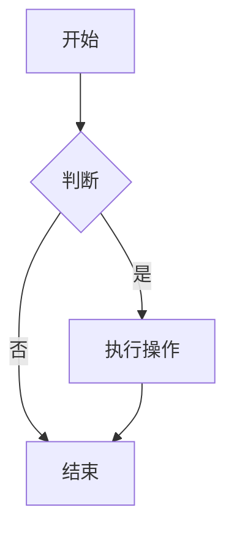

# Mermaid2 Plugin

`mkdocs-mermaid2-plugin` 用于在 Markdown 中渲染 Mermaid 图表。Mermaid 是一种基于文本的图表定义语言，支持流程图、时序图、甘特图等。

## 使用方法

使用 `mermaid` 语言标识符的代码块：

    ```mermaid
    graph TD
    A[Start] --> B{Is it?}
    B -- Yes --> C[OK]
    B -- No --> D[End]
    ```

## 效果演示


