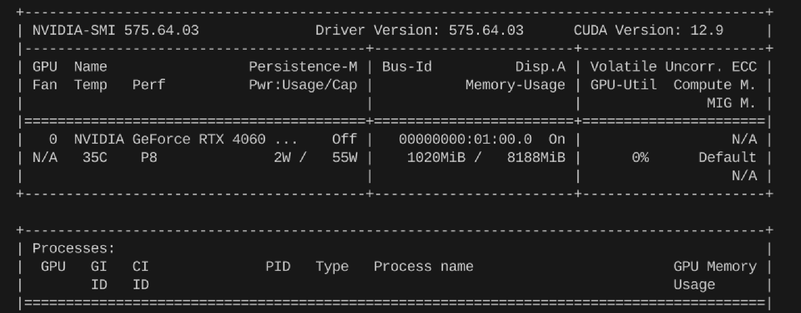

# Docker实践

Docker文档，参考正在进行的[Docker文档翻译](https://github.com/Chesszyh/docker-docs-CN)。

## Docker Desktop vs Docker Engine?

> 杂记：感觉Desktop这玩意并不是很好用，当然也不是必需的(headless服务器，你装一个GUI试试？)。今天想把docker images从C盘迁移到D盘，结果老是在文件移动的最后一步报错`文件被占用`，而此时`vhdx`文件都已经完整移动到D盘了。我先是点了“取消移动”，结果D盘的文件就没了；好嘛，那我重新试一下，这次剪切到D盘之后，我又复制了一份，再取消移动，这回文件被保留了，但C盘的文件还是删不掉。资源管理器找不到占用进程，在网上又搜了好多资料，有人推荐用[Lock-hunter](https://lockhunter.com/)去查找文件被占用的进程并解锁，但我发现`docker_data.vhdx`是被`System`占用的，没法解锁。Windows和WSL2下怎么强制删除也删不掉，最后气得把Docker Desktop卸载了，这回可以删除了。还有，这个破桌面软件不知道为什么老和wsl冲突，经常一起崩溃，或者一个崩溃，真受不了。

### Docker Desktop

参考：https://docs.docker.com/desktop/setup/install/linux/

Docker Desktop会启动一个虚拟机，将容器和镜像存储在虚拟机内的独立存储位置，并提供资源限制控制。如果卸载Docker Desktop, 则对应的镜像和容器也会被删除。Desktop使用`desktop-linux`上下文来运行Docker Engine。**当Docker Desktop和Docker CE同时存在时，Desktop context会遮蔽CE context(default)**，也可能会导致端口冲突问题。可以选择停止Docker CE:

```shell
sudo systemctl stop docker docker.socket containerd
sudo systemctl disable docker docker.socket containerd
```

或者使用`docker context`命令进行上下文切换。

### 实践建议

Windows想要使用docker，只能通过WSL2安装docker engine。如果想要图形化界面的话，再安装Docker Desktop（非必需）。Linux服务器只能安装Docker Engine，并且Linux桌面发行版实际上也不推荐两个一起装。只装docker CE就已经够用了。

## Hostname

`host.docker.internal`：由容器内部自动解析为宿主机的IP地址。

## Download

> 我经常被网络问题弄红温。最近看到一个有意思的项目：[OpenGFW](https://github.com/apernet/OpenGFW)，文档：<https://gfw.dev/docs/>。

国外服务器基本秒下，参考文档：[Ubuntu](https://docs.docker.com/engine/install/ubuntu/)、[Amazon Linux](https://docs.aws.amazon.com/zh_cn/serverless-application-model/latest/developerguide/install-docker.html)和[Fedora](https://docs.docker.com/engine/install/fedora/)。

### Ubuntu

```shell
# 1. Set up Docker's apt repository.

# Add Docker's official GPG key:
sudo apt-get update
sudo apt-get install ca-certificates curl
sudo install -m 0755 -d /etc/apt/keyrings
sudo curl -fsSL https://download.docker.com/linux/ubuntu/gpg -o /etc/apt/keyrings/docker.asc
sudo chmod a+r /etc/apt/keyrings/docker.asc

# Add the repository to Apt sources:
echo \
"deb [arch=$(dpkg --print-architecture) signed-by=/etc/apt/keyrings/docker.asc] https://download.docker.com/linux/ubuntu \
$(. /etc/os-release && echo "${UBUNTU_CODENAME:-$VERSION_CODENAME}") stable" | \
sudo tee /etc/apt/sources.list.d/docker.list > /dev/null

sudo apt-get update

# 2. Install Docker packages.
sudo apt-get install docker-ce docker-ce-cli containerd.io docker-buildx-plugin docker-compose-plugin\

# 3. Verify that Docker Engine is installed correctly by running the hello-world image.
docker run hello-world
```

### Amazon Linux

虽然Amazon Linux 2023基于Fedora，但安装Docker时似乎无需根据官方Fedora文档来，而是参考[Amazon Linux](https://docs.aws.amazon.com/zh_cn/serverless-application-model/latest/developerguide/install-docker.html)自己的文档。

不知道两种方式是否有区别，后续有时间再测试。

```shell
sudo yum update -y
sudo yum install -y docker
# 添加ec2-user到docker组
sudo usermod -a -G docker ec2-user
# 启动Docker
sudo service docker start
```

### Fedora

```shell
# 1. Uninstall old versions
sudo dnf remove docker \
                  docker-client \
                  docker-client-latest \
                  docker-common \
                  docker-latest \
                  docker-latest-logrotate \
                  docker-logrotate \
                  docker-selinux \
                  docker-engine-selinux \
                  docker-engine
# 2. Set up the repository
sudo dnf -y install dnf-plugins-core
sudo dnf-3 config-manager --add-repo https://download.docker.com/linux/fedora/docker-ce.repo

# 3. Install Docker Engine
sudo dnf install docker-ce docker-ce-cli containerd.io docker-buildx-plugin docker-compose-plugin

# 4. Start Docker
sudo systemctl enable --now docker
```

### 国内服务器/自己电脑

阿里云允许预装Docker，图省事的话直接在控制台安装就行。

我自己测试时会出现源问题，所以参考这篇[知乎教程](https://zhuanlan.zhihu.com/p/588264423)，使用阿里镜像下载。

```shell
# 添加阿里的 Docker 镜像仓库证书
curl -fsSL https://mirrors.aliyun.com/docker-ce/linux/ubuntu/gpg | sudo gpg --dearmor -o /etc/apt/keyrings/aliyun-docker.gpg
# 添加仓库
echo \
  "deb [arch=$(dpkg --print-architecture) signed-by=/etc/apt/keyrings/aliyun-docker.gpg] https://mirrors.aliyun.com/docker-ce/linux/ubuntu \
  $(lsb_release -cs) stable" | sudo tee /etc/apt/sources.list.d/docker.list > /dev/null

# 安装docker-ce
sudo apt update
sudo apt install -y docker-ce

# 设置自启动
sudo systemctl enable docker
sudo systemctl start docker

# 验证
sudo docker info
```

后来又发现，按照官网的流程走似乎也可以，不过需要手动替换一下`Add the repository to Apt sources`步骤中的源，其他命令都不用变。

```shell
# 替换成阿里云的源
echo \
  "deb [arch=$(dpkg --print-architecture) signed-by=/etc/apt/keyrings/docker.asc] https://mirrors.aliyun.com/docker-ce/linux/ubuntu \
  $(. /etc/os-release && echo "${UBUNTU_CODENAME:-$VERSION_CODENAME}") stable" | \
  sudo tee /etc/apt/sources.list.d/docker.list > /dev/null
```

## Configuration

### 系统代理与DNS配置

国内使用Docker的第一课：`docker: Error response from daemon: Get "https://registry-1.docker.io/v2/": context deadline exceeded`

被墙了，没办法，配置一下代理或者用国内镜像源（不稳定）吧。

先检查自己系统是否能连上Docker Hub：

```shell
curl https://registry-1.docker.io/v2/
```

**配置代理**，以7897端口的clash-verge为例：

```shell
sudo mkdir -p /etc/systemd/system/docker.service.d
sudo nano /etc/systemd/system/docker.service.d/http-proxy.conf
```

```ini
[Service]
Environment="HTTP_PROXY=http://127.0.0.1:7897"
Environment="HTTPS_PROXY=http://127.0.0.1:7897"
Environment="NO_PROXY=localhost,127.0.0.1"
```

### 镜像源

经常需要更新，比如可参考[Github](https://github.com/dongyubin/DockerHub)。直接google搜"docker最新可用镜像源"就行。

参考配置(`/etc/docker/daemon.json`)：

```json
{
    "runtimes": {
        "nvidia": {
            "path": "nvidia-container-runtime",
            "runtimeArgs": []
        }
    },
    "registry-mirrors": [
        "http://docker.domys.cc",
        "http://hub.domys.cc",
        "https://hub.fast360.xyz",
        "https://hub.rat.dev",
        "https://hub.littlediary.cn",
        "https://docker.kejilion.pro",
        "https://dockerpull.cn",
        "https://docker-0.unsee.tech",
        "https://docker.tbedu.top",
        "https://docker.1panelproxy.com",
        "https://docker.melikeme.cn",
        "https://cr.laoyou.ip-ddns.com",
        "https://hub.firefly.store",
        "https://docker.hlmirror.com",
        "https://docker.m.daocloud.io",
        "https://docker.1panel.live",
        "https://image.cloudlayer.icu",
        "https://docker.1ms.run",
        "https://docker.mybacc.com",
        "https://dytt.online",
        "https://lispy.org",
        "https://docker.xiaogenban1993.com",
        "https://docker.yomansunter.com",
        "https://aicarbon.xyz",
        "https://666860.xyz",
        "https://docker.zhai.cm",
        "https://a.ussh.net",
        "https://dockerproxy.net"
      ]
}
```

换DNS、镜像源：

```shell
sudo mkdir -p /etc/docker
sudo nano /etc/docker/daemon.json
```

```json
{
  "dns": ["8.8.8.8", "1.1.1.1"],
  "registry-mirrors": [
    // 自己找找最新镜像源吧
  ]
}
```

然后重启Docker服务：

```shell
sudo systemctl daemon-reexec
sudo systemctl daemon-reload
sudo systemctl restart docker
```

### Nvidia container toolkit

**注意**：根据这篇[文档](https://forums.docker.com/t/cant-start-containers-with-gpu-access-on-linux-mint/144606)的描述：

> Only Docker Desktop for Windows supports GPUs when the WSL2 backend is used, since WSL2 supports GPUs. Docker Desktop for Linux does not support it, but you can install Docker CE which does.

所以，Fedora更是无需安装Docker Desktop，参考[官方文档](https://docs.nvidia.com/datacenter/cloud-native/container-toolkit/latest/install-guide.html)安装Nvidia container toolkit即可。

```shell
curl -s -L https://nvidia.github.io/libnvidia-container/stable/rpm/nvidia-container-toolkit.repo | \
sudo tee /etc/yum.repos.d/nvidia-container-toolkit.repo
export NVIDIA_CONTAINER_TOOLKIT_VERSION=1.17.8-1
sudo dnf install -y \
    nvidia-container-toolkit-${NVIDIA_CONTAINER_TOOLKIT_VERSION} \
    nvidia-container-toolkit-base-${NVIDIA_CONTAINER_TOOLKIT_VERSION} \
    libnvidia-container-tools-${NVIDIA_CONTAINER_TOOLKIT_VERSION} \
    libnvidia-container1-${NVIDIA_CONTAINER_TOOLKIT_VERSION}

sudo nvidia-ctk runtime configure --runtime=docker
sudo systemctl restart docker
# 测试
docker run --rm --gpus all nvidia/cuda:12.2.0-base-ubuntu20.04 nvidia-smi
```

输出：

配置成功。

## 基础

### Images && Containers

**Images**: **镜像**是一个只读的模板，用于创建容器。可以基于一个镜像启动多个容器。
**Containers**: **容器**是镜像的一个实例。容器是一个轻量级、可执行的独立软件包，包含运行某个软件所需的所有代码、运行时、系统工具、库和设置。

```shell
# Images
docker pull <image_id_or_name>  # 拉取镜像
docker run -d -p 80:80 <image_id_or_name> # 运行镜像：-d表示后台运行，-p表示端口映射
docker images # 查看镜像
docker images --filter reference=<image_id_or_name> # 查看镜像
docker rmi -f <image_id_or_name>  # 删除镜像：如果镜像正在被使用，则需要加-f强制删除
# Containers
docker containers ls -a # 查看所有容器，包括停止的容器
docker start/stop/rm <container_id_or_name>
docker exec -it <container_id_or_name> bash # 进入容器：-it表示交互式终端
```

### 启动设置

- WSL2下的Docker Desktop默认是开机自启的，也可以在`/etc/wsl.conf`中设置WSL开机时自动执行的命令，参考：https://learn.microsoft.com/en-us/windows/wsl/wsl-config

```ini
# Set a command to run when a new WSL instance launches. This example starts the Docker container service.
[boot]
command = service docker start
```

- 禁止某容器开机自启动(修改容器的重启策略)：`docker update --restart no <container_id_or_name>`
    - 手动关闭容器后，下次容器在 Docker 守护进程启动或容器退出时将不会自动重启。

## Openai API Proxy

参考仓库：[chatgptProxyAPI](https://github.com/x-dr/chatgptProxyAPI)(已经被Archive了)

使用Cloudflare的方法，在我这里似乎有些问题；所以我就采用了作者不推荐的Docker部署。我没有**VPS(Virtual Private Server)**，所以就同样使用了一年免费的AWS EC2，并在开放端口上做了限制，即用即开。更好的解决方案应该是只对我的IP开放端口，但我没法长期稳定使用一个节点，IP老是变，所以就暂时设的是使用时开放0.0.0.0/0，使用完后关闭。此外还有一个不推荐的原因是**不支持SSE**(Server-Sent Events，实时聊天常用)，原因我也不是很清楚，目前自用好像也没啥问题，所以暂时先不管了。

```shell
# 将容器内3000端口映射到主机的4000端口
# README里都是3000，但我3000被open-webui占用了，所以改成4000
docker run -itd --name openaiproxy \
            -p 4000:3000 \
            --restart=always \
           gindex/openaiproxy:latest

# 使用：
curl --location 'http://[YOUR_SERVER_IP]:4000/proxy/v1/chat/completions' \
--header 'Authorization: Bearer sk-xxxxxxxxxxxxxxx' \
--header 'Content-Type: application/json' \
--data '{
   "model": "gpt-3.5-turbo",
  "messages": [{"role": "user", "content": "Hello!"}]
 }'
```

## AWS Docker Private Registry

### 手动搭建

我在使用国内镜像源下载Open-Webui Docker镜像时，发现速度依然很慢，所以就考虑用AWS在美国的EC2上搭建一个私有Registry，然后国内的阿里云服务器从AWS上拉取镜像。实测，速度比之前镜像快很多，但还是比不上国外直接从Docker Hub拉取的速度。

AWS似乎还提供了AWS ECR(Elastic Container Registry)服务，也可以直接拿来用。

> 注：以下命令中，我AWS的实际公网ip用`[aws]`替换。

```shell
# 在 AWS EC2 上手动从 Docker Hub 拉取镜像，以hello-world为例
docker pull hello-world

# 运行私有 Registry
docker run -d -p 5000:5000 --name registry registry:2
docker ps # 应看到STATUS为Up的registry容器

# 为hello-world镜像打上标签
docker tag hello-world:latest [aws]:5000/chesszyh987/hello-world:latest

# 检查registry是否能够在另一台主机上访问
curl http://[aws]:5000/v2/_catalog # 如果返回{"repositories":[]}，说明registry正常工作

# 修改配置文件，使用 HTTP 协议连接到你的私有 Registry
sudo vim /etc/docker/daemon.json
# 添加以下选项
{
  "insecure-registries": ["[aws]:5000"]
}
sudo systemctl daemon-reexec    # 重新加载配置文件
sudo systemctl restart docker   # 重启docker服务

# 推送镜像到私有 Registry
docker push [aws]:5000/chesszyh987/hello-world:latest

# 在另一台主机上拉取镜像
docker pull [aws]:5000/chesszyh987/hello-world:latest

# 运行镜像
docker run -d -p 80:80 [aws]:5000/chesszyh987/hello-world:latest # 输出Hello World!
```

### 使用 AWS ECR

接下来，我们将从头开始创建一个Docker镜像，并将其推送到AWS ECR。

#### AWS认证

```shell
# 配置AWS凭证
aws configure
# AWS Access Key ID：AWS 的访问密钥 ID。
# AWS Secret Access Key：AWS 的秘密访问密钥。
# Default region name：设置你使用的区域（比如 us-east-2）。
# Default output format：通常选择 json。

# 登录 AWS ECR
aws ecr get-login-password --region us-east-2 | docker login --username AWS --password-stdin 412381757149.dkr.ecr.us-east-2.amazonaws.com
```

#### 生成Docker镜像

参考资源：[创建容器镜像以在 Amazon ECS 上使用](https://docs.aws.amazon.com/zh_cn/AmazonECS/latest/developerguide/create-container-image.html)和[在 Amazon ECR 中移动映像的整个生命周期](https://docs.aws.amazon.com/zh_cn/AmazonECR/latest/userguide/getting-started-cli.html)

首先，编写Dockerfile文件。

```dockerfile
FROM public.ecr.aws/amazonlinux/amazonlinux:latest  # 使用 Amazon ECR Public 上托管的 Amazon Linux 2 公有映像

# Update installed packages and install Apache
RUN yum update -y && \
 yum install -y httpd

# Write hello world message
RUN echo 'Hello World!' > /var/www/html/index.html

# Configure Apache
RUN echo 'mkdir -p /var/run/httpd' >> /root/run_apache.sh && \
echo 'mkdir -p /var/lock/httpd' >> /root/run_apache.sh && \
echo '/usr/sbin/httpd -D FOREGROUND' >> /root/run_apache.sh && \
chmod 755 /root/run_apache.sh

EXPOSE 80   # Expose port 80 for the web server

CMD /root/run_apache.sh # Start Apache in the foreground
```

然后执行以下命令来构建镜像。

```shell
# 构建镜像
docker build -t hello-world .

# 检查镜像
docker images --filter reference=hello-world

# 运行镜像
docker run -t -i -p 80:80 hello-world # -p 80:80 将容器的80端口映射到主机的80端口
```

访问`http://[aws]:80`，应该能看到Hello World!

#### 推送镜像到AWS

首先通过AWS ECR创建一个存储库，访问Amazon ECR - Private registry - Repositories，或者CLI命令行创建：`aws ecr create-repository --repository-name hello-repository --region region`

其实接下来的步骤跟着AWS的提示走就行了。

```shell
# 给镜像打标签，假设你的AWS账号ID是412381757149，区域是us-east-2，存储库命令空间/命名为cloudserver/docker
docker tag hello-world:latest 412381757149.dkr.ecr.us-east-2.amazonaws.com/cloudserver/docker:latest
# 推送镜像到AWS ECR
docker push 412381757149.dkr.ecr.us-east-2.amazonaws.com/cloudserver/docker:latest
# 清除ECR中的镜像
# aws ecr delete-repository --repository-name cloudserver/docker --region region --force
```

#### 从AWS ECR拉取镜像

先决条件：另一台主机也需要安装AWS CLI并配置好凭证。Amazon Linux自带了AWS CLI，但是其他操作系统均需要手动安装。

安装CLI参考：[安装或更新最新版本的 AWS CLI](https://docs.aws.amazon.com/zh_cn/cli/latest/userguide/getting-started-install.html)

```shell
docker pull 412381757149.dkr.ecr.us-east-2.amazonaws.com/cloudserver/docker:latest
```

## 日志管理

Docker日志默认存储在`/var/lib/docker/containers/[容器ID]/[容器ID]-json.log`中。可以修改`etc/docker/daemon.json`文件以配置日志轮转：

```json
{
  "log-driver": "json-file",
  "log-opts": {
    "max-size": "10m",
    "max-file": "3"
  }
}
```

然后重启服务：`sudo systemctl restart docker`。以后运行容器时，也可以使用`--log-opt max-size=10m --log-opt max-file=3`来覆盖默认设置。