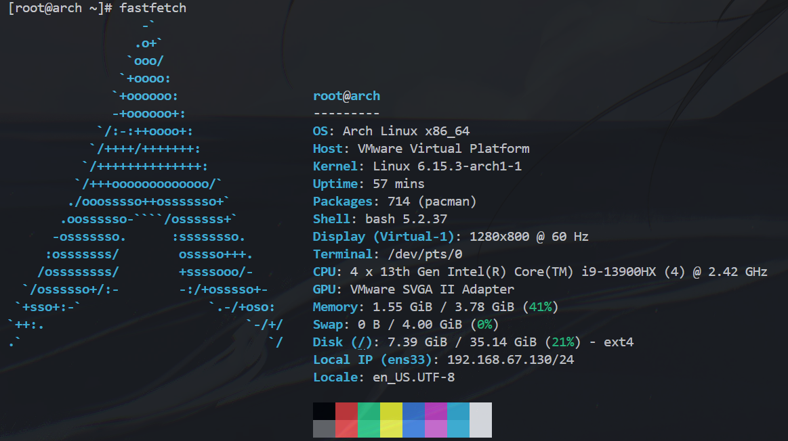

# Arch Linux

- [我第一次安装参考的教程](https://blog.csdn.net/OceanWaves1993/article/details/130467985)

## Installation Script

- [自动安装脚本](https://github.com/archlinux/archinstall)

## Installation on WSL2

比较简单，参考：https://wiki.archlinuxcn.org/wiki/%E5%9C%A8_WSL_%E4%B8%8A%E5%AE%89%E8%A3%85_Arch_Linux

```shell
wsl --update
wsl --install archlinux
```

WSL默认会安装到C盘，可以更改其安装位置：

```shell
wsl --export archlinux D:\archlinux.tar
wsl --unregister archlinux # 卸载原来的WSL
wsl --import Arch-Linux D:\WSL2\Arch-Linux D:\archlinux.tar --version 2
Remove-Item D:\archlinux.tar
wsl --set-default Arch-Linux
```

## Installation on VMWare

下载ISO后，**设置BIOS从ISO启动，需要勾选`已连接`和`启动时连接`**。

### 配置网络

```shell
# 创建网络配置文件
# filepath: /etc/systemd/network/20-wired.network
cat > /etc/systemd/network/20-wired.network <<EOF
[Match]
Name=ens33

[Network]
DHCP=yes
EOF

# 启用 systemd-networkd 服务
systemctl enable systemd-networkd systemd-resolved

# 为了让域名解析正常工作，需要将系统的 DNS 配置链接到 systemd-resolved
ln -sf /run/systemd/resolve/stub-resolv.conf /etc/resolv.conf

# 再次检查ip
ip a

# 测试
ping www.baidu.com
```

### 配置静态 IP 地址

> 这步弄完之后，不知道为什么无法连接到网络了，所以我选择了回滚并暂时不使用静态 IP 地址。

```shell
# filepath: /etc/systemd/network/20-wired.network
[Match]
Name=ens33

[Network]
Address=192.168.2.140/24
Gateway=192.168.67.0    # 必须是 VMWare 虚拟网络的正确网关地址
DNS=223.5.5.5       # 阿里云
DNS=119.29.29.29    # 腾讯云
```

### 配置 SSH

```shell
# 安装 OpenSSH
pacman -S openssh
# 修改配置文件: /etc/ssh/sshd_config中，`PermitRootLogin` 改为 `yes`

# 设置开机启动
systemctl enable sshd
systemctl start sshd
```

遇到问题：指纹错误导致主机拒绝连接

```shell
PS D:\Git\Project\Information-Security\Linux> ssh root@192.168.67.130
@@@@@@@@@@@@@@@@@@@@@@@@@@@@@@@@@@@@@@@@@@@@@@@@@@@@@@@@@@@
@    WARNING: REMOTE HOST IDENTIFICATION HAS CHANGED!     @
@@@@@@@@@@@@@@@@@@@@@@@@@@@@@@@@@@@@@@@@@@@@@@@@@@@@@@@@@@@
IT IS POSSIBLE THAT SOMEONE IS DOING SOMETHING NASTY!
Someone could be eavesdropping on you right now (man-in-the-middle attack)!
It is also possible that a host key has just been changed.
The fingerprint for the ED25519 key sent by the remote host is
SHA256:AFyLwX21uJhxPbmd00CrrHMtyc20OvXCaaDBPHGN1fY.
Please contact your system administrator.
Add correct host key in C:\\Users\\zyh2005/.ssh/known_hosts to get rid of this message.
Offending ECDSA key in C:\\Users\\zyh2005/.ssh/known_hosts:79
Host key for 192.168.67.130 has changed and you have requested strict checking.
Host key verification failed.
```

解释：`WARNING: REMOTE HOST IDENTIFICATION HAS CHANGED!`说明`192.168.67.130`的机器指纹已经改变(重装系统导致的)，再次用同一个主机 IP 地址去连接时，主机出于安全考虑（防止中间人攻击）拒绝了连接。

只需要删除`.ssh/known_hosts`文件中对应的行即可。

### 创建普通用户

```bash
useradd -m chesszyh
passwd chesszyh
pacman -S sudo
# 编辑 sudoers 文件
EDITOR=vim visudo

# 找到`%wheel ALL=(ALL) ALL`这一行，取消注释

# 将`chesszyh`用户添加到`wheel`组
usermod -aG wheel chesszyh
```

### 安装引导加载程序 (Bootloader)

```shell
# 1. 安装 GRUB 软件包
pacman -S grub

# 2. 将 GRUB 安装到硬盘的主引导记录 (MBR)
#    注意：是安装到 /dev/sda (整个硬盘)，而不是 /dev/sda1 或 /dev/sda2 (分区)
grub-install --target=i386-pc /dev/sda

# 3. 生成 GRUB 配置文件
grub-mkconfig -o /boot/grub/grub.cfg
```

### 安装桌面

以下参考[偏日常使用的 Arch Linux 桌面环境教程](https://arch.icekylin.online/guide/rookie/desktop-env-and-app)。

```bash
# 安装显示服务器来绘制窗口和图形
# pacman -S xorg-server

# 安装KDE Plasma桌面环境
pacman -S plasma-meta konsole dolphin # plasma-meta 元软件包、konsole 终端模拟器和 dolphin 文件管理器。plasma会默认安装xorg。
```

AI推荐选择：

1. `qt6-multimedia-ffmpeg`
2. `noto-fonts`
3. `phonon-qt6-vlc`

```shell
# 配置并启动greeter sddm
systemctl enable sddm
systemctl start sddm
```

### 成功安装！



## 其他问题

### 调整分区大小

虚拟机从20G调整到40G后，分区大小没有自动调整。

先扩展分区：

```shell
sudo pacman -S parted
sudo parted /dev/sda
print   # 打印分区表，发现/dev/sda总大小40G，但/dev/sda1只有20G
resizepart 2 100% # 调整分区2大小到100%，注意选择实际/dev/sda2的分区号
quit   # 退出parted
```

再扩展文件系统：

```shell
sudo resize2fs /dev/sda2
df -h # 查看分区大小，/dev/sda2应该变成40G了
```


