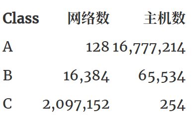

# IPv4, IPv6

## 参考资源

- [为什么 IPv6 难以取代 IPv4](https://draven.co/whys-the-design-ipv6-replacing-ipv4/)

该文章总结：

1. NAT 技术可以很大程度上缓解 IPv4 的地址短缺问题并且能够保护私有内部的网络，提供防火墙的功能；

NAT：通过转换表进行IP映射，减少公网IP使用。

2. IPv4 与 IPv6 协议完全不兼容，我们需要引入双协议栈、隧道技术或者 NAT64 解决兼容性问题，而应用这些技术也需要额外的成本；

3. 通过对资源的细粒度管控并回收不再使用的 IP 地址，可以延缓 IP 地址耗尽的时间；

    1. 分类网络架构（Classful Network Architecture）：
    2. 无类别域间路由（Classless Inter-Domain Routing、CIDR），基于**可变长子网掩码**（Variable-length Subnet Masking、VLSM）：

## ipv6

**IPv6 (Internet Protocol version 6)** 是用于在网络上传输数据的最新版本的互联网协议，旨在最终取代目前广泛使用的 IPv4。IPv4使用32位地址，最多可以提供约43亿个唯一地址，但由于互联网的快速增长，2011年已经耗尽了可用的顶级IPv4地址。IPv6 使用 128 位地址，提供了几乎无限的地址空间（大约 3.4 x 10^38 个，“可以给地球上每个沙子分配一个IPv6地址”）。IPv6无需**网络地址转换 (NAT)**，可实现设备之间的端到端通信，也可做到**无状态地址自动配置 (SLAAC)**，即设备可以自动配置自己的 IPv6 地址，无需 DHCP 服务器。

一个设备可以有多个 IPv6 地址：

1. **全球单播地址 (Global Unicast Address, GUA)**：可在全球范围内唯一标识一个设备，类似于公网IPv4地址。
2. **临时地址 (Temporary Address)**：也是GUA，但会定期更换以保护隐私。
3. **链路本地地址 (Link-Local Address, LLA)**：仅在**单一物理网段（链路）内有效且唯一**，通常以 `fe80` 开头，用于局域网设备之间的直接通信。
4. **唯一本机地址 (Unique Local Address, ULA)**：以 `fc00::`或 `fd00::` 开头，在一个站点或组织内部可以路由，但不能在公共互联网上路由。类似于 IPv4 的私有地址（如 `192.168.x.x`）。ULA 在设计上具有高概率的**全局唯一性**（通过随机生成部分），以减少未来网络合并时的冲突，但不保证且不用于公网。

**LLA和ULA的区别**(by Gemini 2.5)：

LLA: 就像你房间里的门牌号，只在你家这条走廊有用。
ULA: 就像你们小区内部的楼栋和单元号，在小区内可以找到，但邮递员从外面寄信不能直接用这个地址。

### IPv6支持

- 访问测试网站：[test-ipv6.com](http://test-ipv6.com/)
- Ping测试：`ping ipv6.google.com`或`ping -6 google.com`
    - 我的设备上是ping不通的，但是可以访问上述测试网站。
- 或者直接问网络管理员，当然，我才不愿意问

### 注意事项

1. IPv6同样会被校园网防火墙屏蔽，阻止入站流量
2. 校园网分配的公网 IPv6 地址可能是动态的，若是，可以使用DDNS动态域名解析获取稳定访问
3. 访问者也必须支持IPv6，才能访问到你的服务器