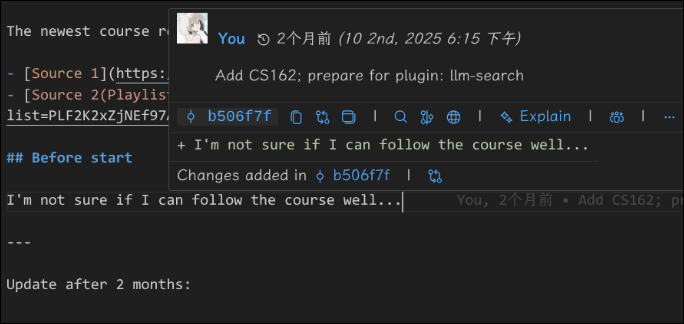

# CS162 Note

## Sources

- [csdiy](https://csdiy.wiki/%E6%93%8D%E4%BD%9C%E7%B3%BB%E7%BB%9F/CS162/#_1)
- [pku-pintOS](https://pkuflyingpig.gitbook.io/pintos/)
- [Course Website](https://cs162.org/)

The newest course record found on Youtube is around 2021.

- [Source 1](https://www.youtube.com/watch?v=YfHY0pvpRkk)
- [Source 2(Playlist)](https://www.youtube.com/playlist?list=PLF2K2xZjNEf97A_uBCwEl61sdxWVP7VWC)

## Before start

I'm not sure if I can follow the course well...

---

Update after 2 months:

Well, I gave up after the first lecture. Typically my behavior.

