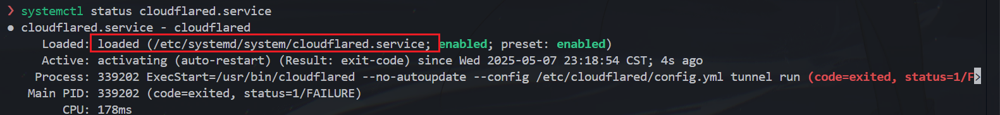

# Code Server部署

**杂记**：

1. `sudo vim /etc/cloudflared/config.yml`时始终无法写入文件

解决：最开始还以为SSH的权限出了问题，vim/nano都改不了，nano的提示更有帮助一些：“没有那个文件或目录”。这说明`config.yml`的目录路径中有文件夹根本就不存在，建一个就好了。

2. CF Tunnel无法启动，`cloudflared --config /usr/local/etc/cloudflared/config.yml tunnel run`输出`Tunnel credentials file '/root/.cloudflared/3362d13f-8cf3-492a-b154-77d069c73096.json' doesn't exist or is not a file`

解决：本地机器所有服务全是以普通用户而非root身份运行的，`.cloudflared`文件夹在`/home/chesszyh`下，配置文件里把`credentials file`位置写错了，当然找不到！

在发现这个问题之前，我尝试了`sudo cloudflared service install`(即将cftunnel永久运行)，结果导致`systemctl`加载的配置文件也出错了，如图：。

纠正：`sudo systemctl status cloudflared.service`修改`systemctl`服务配置文件，将`ExecStart=/usr/bin/cloudflared --no-autoupdate --config /etc/cloudflared/config.yml tunnel run`改为`ExecStart=/usr/bin/cloudflared --no-autoupdate --config /usr/local/etc/cloudflared/config.yml tunnel run`，然后：`sudo systemctl daemon-reload`，`sudo systemctl restart cloudflared.service`即可。

3. 云服务器上服务一直520错误，如图：

**排查思路**：

1. Nginx配置文件是否正确? 是否正常运行? `sudo nginx -t`，`sudo systemctl status nginx.service`
2. 检查 Nginx 的 SSL 配置

## 基础部署

```shell
curl -fsSL https://code-server.dev/install.sh | sh
# 被墙的话，就手动上传安装包：sudo dpkg -i xx.deb
sudo vim ~/.config/code-server/config.yaml # 修改配置

# 安装nginx与certbot并配置
sudo apt update
sudo apt install -y nginx certbot python3-certbot-nginx

# 配置nginx
vim /etc/nginx/sites-available/code-server
```

```ini
server {
    listen 80;
    listen [::]:80;
    server_name mydomain.com;

    location / {
      proxy_pass http://localhost:8080/;    # 或其他端口
      proxy_set_header Host $host;
      proxy_set_header Upgrade $http_upgrade;
      proxy_set_header Connection upgrade;
      proxy_set_header Accept-Encoding gzip;
    }
}
```

```shell
sudo ln -s ../sites-available/code-server /etc/nginx/sites-enabled/code-server
# 生成证书
sudo certbot --non-interactive --redirect --agree-tos --nginx -d code.neurosama.uk -m chesszyh987@gmail.com

# 配置守护进程
sudo vim /usr/lib/systemd/system/code-server.service
```

参考：

```ini
[Unit]
Description=code-server
After=network.target

[Service]
Type=exec
Environment=HOME=/root
ExecStart=/usr/bin/code-server
Restart=always
```

**生成证书**那步，如果是在云服务器环境下遇到`Timeout during connect (likely firewall problem)`，直接在命令行`ufw allow 80`可能不管用，必须在云服务器控制台上放行80端口。

成功截图：

### Troubleshooting

1. 阿里云部署的Code-server，经Cloudflare CDN解析(不代理)后，通过域名访问时进的很慢，有时候甚至进不去，导航栏显示`Non-compliance lCp Filing`；如果使用CF代理，则大概率报错：`Web server is returning an unknown error; Error 520`。但是直接通过`ip:port`访问是正常的。

分析：域名没备案，而中国的网络服务提供商（ISP）或云服务商（如阿里云、腾讯云等）会对未备案的网站进行限制，导致访问速度慢或无法访问。

不备案的话应该是无解的，但是不做网站只跑服务就没事，之前Lichess Stockfish Bot我跑的好好的，一点事没有。

## 内网穿透

公网服务器不用考虑此步。以下使用Cloudflare Tunnel实现内网穿透，将我本地服务器9384端口安全地暴露到公网，可通过`code.neurosama.uk`访问。

**注意**：

配置各种服务时，不要盲目跟着教程走，先看看自己是以什么身份(root还是普通用户?)运行的什么服务(nginx、cloudflared、systemd?)，然后再去修改配置文件，避免不必要的麻烦。

```shell
# 安装、登录
wget https://github.com/cloudflare/cloudflared/releases/latest/download/cloudflared-linux-amd64.deb
sudo dpkg -i cloudflared-linux-amd64.deb
cloudflared tunnel login

# 创建隧道
cloudflared tunnel create code-server-tunnel
# 需要记下tunnel id，比如：3362d13f-8cf3-492a-b154-77d069c73096
# 配置隧道
vim /usr/local/etc/cloudflared/config.yml
```

参考格式：

```yaml
tunnel: <你的-tunnel-id>
credentials-file: /root/.cloudflared/<你的-tunnel-id>.json

ingress:
  - hostname: code.neurosama.uk
    service: http://localhost:9384
  - service: http_status:404
```

然后连接隧道：

```shell
# 连接隧道
cloudflared tunnel route dns code-server-tunnel code.neurosama.uk
# 注：第一次尝试时报错：Failed to add route: code: 1003, reason: Failed to create record code.neurosama.uk with err An A, AAAA, or CNAME record with that host already exists. 
# 改个域名就好了，code是我云服务器的域名。无需登录cf控制台，直接在命令行中执行即可。
```

持久化运行：

```shell
sudo cloudflared service install    # 安装服务
sudo systemctl start cloudflared    # 启动隧道
sudo systemctl enable cloudflared   # 开机自启
sudo systemctl status cloudflared   # 查看状态
```

## 环境配置

### C++开发环境

```shell
sudo apt install cmake clang gdb
sudo apt-get install clangd # clangd服务器
sudo update-alternatives --install /usr/bin/clangd clangd /usr/bin/clangd-18 100 # 设置clangd为默认
ln -sf /build/compile_commands.json .   
```