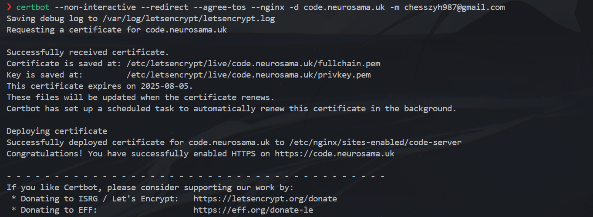
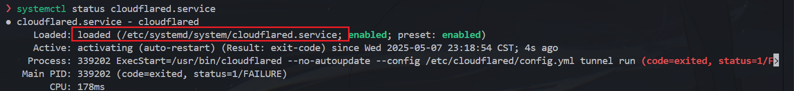
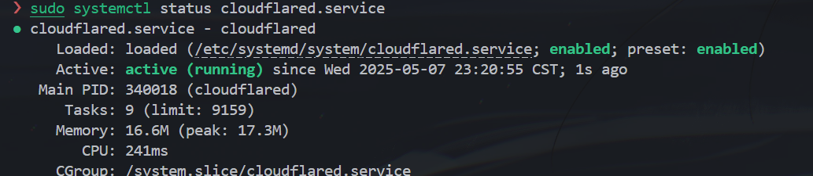

# Code Server部署

## Before start

Code-server一般使用云服务器就足够了，没必要本地电脑+cf tunnel穿透之类的解决方案。就写个代码能要啥高端配置？

Code-server功能其实远不如Vscode完善，正常来说使用vscode-remote-ssh远程开发就足够了。server主要解决的是在**浏览器**中使用类vscode开发环境的需求，比如利用ipad写代码。

如果没这个需求，其实就没必要折腾code-server了。ipad上装个Termius+云服务器配置好的neovim(可以做到类似vscode的程度)，比code-server更轻量和高效。

## 基础部署(手动安装)

基础部署部分记录时，我使用的是本地电脑(Ubuntu 24.04)+Cloudflare Tunnel的方案。

```shell
curl -fsSL https://code-server.dev/install.sh | sh
# 被墙的话，就手动上传安装包：sudo dpkg -i xx.deb
sudo vim ~/.config/code-server/config.yaml # 修改配置

# 安装nginx与certbot并配置
sudo apt update
sudo apt install -y nginx certbot python3-certbot-nginx

# 配置nginx
vim /etc/nginx/sites-available/code-server
```

```ini
server {
    listen 80;
    listen [::]:80;
    server_name mydomain.com;

    location / {
      proxy_pass http://localhost:8080/;    # 或其他端口
      proxy_set_header Host $host;
      proxy_set_header Upgrade $http_upgrade;
      proxy_set_header Connection upgrade;
      proxy_set_header Accept-Encoding gzip;
    }
}
```

```shell
sudo ln -s ../sites-available/code-server /etc/nginx/sites-enabled/code-server
# 生成证书
sudo certbot --non-interactive --redirect --agree-tos --nginx -d code.neurosama.uk -m chesszyh987@gmail.com

# 配置守护进程
sudo vim /usr/lib/systemd/system/code-server.service
```

参考：

```ini
[Unit]
Description=code-server
After=network.target

[Service]
Type=exec
Environment=HOME=/root
ExecStart=/usr/bin/code-server
Restart=always
```

**生成证书**那步，如果是在云服务器环境下遇到`Timeout during connect (likely firewall problem)`，直接在命令行`ufw allow 80`可能不管用，必须在云服务器控制台上放行80端口。

成功截图：

## Code Server Docker

Code-server提供docker部署方式，可以更好的管理多用户共用一台服务器的情况。docker部署，我选择云服务器。

### docker-compose.yml

<details>  
<summary>Click to expand</summary>

```yaml

```
</details>

### 单用户

```bash
mkdir -p ~/.config
docker run -it --name code-server -p 127.0.0.1:8080:8080 \
  -v "$HOME/.local:/home/coder/.local" \
  -v "$HOME/.config:/home/coder/.config" \
  -v "$PWD:/home/coder/project" \
  -u "$(id -u):$(id -g)" \
  -e "DOCKER_USER=$USER" \
  codercom/code-server:latest
```

默认是仅监听本地环回地址，也可改为`0.0.0.0`以监听所有地址。

### 多用户(Docker Compose)

阅读：https://docs.docker.com/compose/intro/compose-application-model。通过`docker-compose`管理多用户开发环境和资源配置。

```bash
mkdir -p ~/.config
docker-compose up -d
```

### Nginx

- 配置DNS
  - 确保域名解析到服务器IP，并关闭Cloudflare代理(防止证书认证失败)
  - A ：`coder1.neurosama.uk`
  - CNAME ：`www.coder1.neurosama.uk` -> `coder1.neurosama.uk`
- 开放服务端口和`443`端口
  - 坑：因为未开放443导致HTTPS流量进不去
- 安装`certbot`
  - `sudo apt install certbot python3-certbot-nginx`
- 配置`nginx`
  - 在`/etc/nginx/sites-available/`下创建配置文件
    - `sites-available`是配置文件存放目录，通过创建符号链接到`sites-enabled`目录来启用配置
    - nginx会自动检查所有`sites-enabled`目录下的配置文件
  - 配置文件内容示例：

```conf
server {
    listen 80;
    listen [::]:80;

    server_name coder1.neurosama.uk www.coder1.neurosama.uk;

    location / {
        proxy_pass http://127.0.0.1:8081; # 后端应用地址。使用127.0.0.1可以确保是ipv4，localhost可能有问题
        proxy_set_header Host $host;
        proxy_set_header X-Real-IP $remote_addr;
        proxy_set_header X-Forwarded-For $proxy_add_x_forwarded_for;
        proxy_set_header X-Forwarded-Proto $scheme;
        # 支持WebSocket（否则code-server无法正常进入）
        proxy_set_header Upgrade $http_upgrade; 
        proxy_set_header Connection "upgrade";  
    }
}
```

- 测试并重新加载`nginx`
  - `sudo nginx -t` 
  - `sudo systemctl reload nginx`

- 生成证书
  - `sudo certbot --nginx -d coder1.neurosama.uk -d www.coder1.neurosama.uk`
  - 这会自动配置HTTPS并更新`nginx`配置文件(由`certbot`完成)
- 重新启用Cloudflare代理
- 检查`nginx`日志：`sudo tail -f /var/log/nginx/error.log`

## Issues

### CF Tunnel无法启动

`cloudflared --config /usr/local/etc/cloudflared/config.yml tunnel run`输出`Tunnel credentials file '/root/.cloudflared/3362d13f-8cf3-492a-b154-77d069c73096.json' doesn't exist or is not a file`

解决：本地机器所有服务全是以普通用户而非root身份运行的，`.cloudflared`文件夹在`/home/chesszyh`下，配置文件里把`credentials file`位置写错了，当然找不到！

在发现这个问题之前，我尝试了`sudo cloudflared service install`(即将cftunnel永久运行)，结果导致`systemctl`加载的配置文件也出错了，如图：。

纠正：`sudo systemctl status cloudflared.service`修改`systemctl`服务配置文件，将`ExecStart=/usr/bin/cloudflared --no-autoupdate --config /etc/cloudflared/config.yml tunnel run`改为`ExecStart=/usr/bin/cloudflared --no-autoupdate --config /usr/local/etc/cloudflared/config.yml tunnel run`，然后：`sudo systemctl daemon-reload`，`sudo systemctl restart cloudflared.service`即可。

### 云服务器上服务一直520错误

如图：

**排查思路**：

1. Nginx配置文件是否正确? 是否正常运行? `sudo nginx -t`，`sudo systemctl status nginx.service`
2. 检查 Nginx 的 SSL 配置

### 域名未备案问题

阿里云部署的Code-server，经Cloudflare CDN解析(不代理)后，通过域名访问时进的很慢，有时候甚至进不去，导航栏显示`Non-compliance lCp Filing`；如果使用CF代理，则大概率报错：`Web server is returning an unknown error; Error 520`。但是直接通过`ip:port`访问是正常的。

分析：域名没备案，而中国的网络服务提供商（ISP）或云服务商（如阿里云、腾讯云等）会对未备案的网站进行限制，导致访问速度慢或无法访问。

不备案的话应该是无解的，但是不做网站只跑服务就没事，之前Lichess Stockfish Bot我跑的好好的，一点事没有。