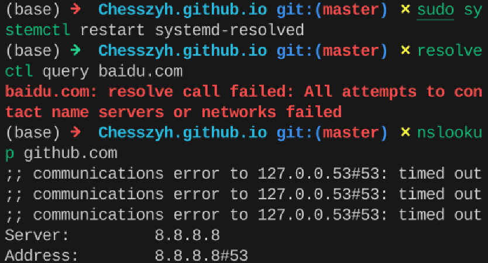

# 待解决问题

- [x]: 已解决
- [?]: 不可稳定复现，最近暂时没有遇到的问题
- [!]: 待解决，影响使用
- [ ]: 待解决，不影响使用

---

- [x] 移动热点dns劫持？

Fedora:`sudo tailscale up`无反应，`nslookup controlplane.tailscale.com`解析到的IP是`198.18.0.10`（保留段），说明发生了DNS劫持。

尝试解决：`sudo nano /etc/resolv.conf`，将`nameserver 127.0.0.53`注释掉，改为`nameserver 8.8.8.8`，然后重启`tailscale`服务，但是`resolv.conf`文件会被自动重置。如果想解除其他程序对`resolv.conf`的控制，可以先删除再重建该文件。我选择手动管理。

但是，现在DNS似乎无法正确解析了：

可能后续还是得恢复原始配置。不过我是真想不通为什么无法解除DNS劫持状态？

相关讨论：https://stackoverflow.com/questions/19432026/how-do-i-edit-resolv-conf

ipad连接热点之后不会发生DNS劫持，可以正常登录tailscale。考虑解决：dnscrypt-proxy或cloudflared。

---

问题已解决，应该是开了clash verge tun模式的原因, tun后DNS变为了198.18.0.2，接管了所有网络流量。

所以如果需要正常解析DNS，要关闭clash verge tun模式。

- [?] Fedora dnf error

官方源404，据说是官方问题……清华源403,阿里云可以正常下载。没明白为什么

- [!] 输入法fcitx5 rime

rime在输入中文时，如果按了大写锁定键，之后会一直保持西文输入模式，无法切换回来，只能重启。

配置文件在`~/.local/share/fcitx5/rime`.

- [ ] Snipaste AppImageLauncher error

AppImageLauncher的.desktop文件位于`~/.local/share/applications/`。

目前无法通过rofi启动Snipaste，直接启动appimage会报错：`qt.qpa.plugin: Could not find the Qt platform plugin "wayland" in ""`。

AppImage 的核心特点是“自包含”。它会把自己需要的大部分库（包括 Qt 框架）都打包在一起。在系统层级安装依赖库，似乎并不能解决这个问题。

我尝试提取appimage内容：`./Snipaste.AppImage --appimage-extract` 然后 `cd squashfs-root && export QT_QPA_PLATFORM=xcb; ./AppRun`：同样是启动就退出。

已知的是Snipaste对Wayland的支持不佳，issue也没看到类似的问题，暂时不用snipaste截图了。

