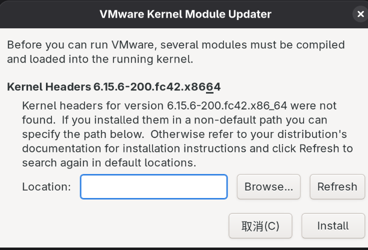

# VMWare

我的主力机器是Fedora 42。

## Kernel 6.15.6

VMware Workstation 17.6.4对Linux 6.15.6内核支持稍有问题，安装后初次启动会报错找不到内核头文件：

解决方法：`sudo dnf install kernel-devel-$(uname -r)`

再次启动时依然报错，找不到`driver-config.h`文件。根据[讨论](https://discussion.fedoraproject.org/t/vmware-linux-driverlog-c10-fatal-error-driver-config-h-no-such-file-or-directory/156612/2)指出的相关[Issue](https://github.com/mkubecek/vmware-host-modules/issues/306)，需要下载补丁包并编译安装。`make`, `sudo make install`。补丁包会安装`vmmon`和`vmnet`模块。

安装后可以正常进入VMWare，但是启动虚拟机时(运行时)报错：

原因是Secure Boot禁止了VMWare的内核模块启动。参考[讨论](https://askubuntu.com/questions/1096052/vmware-15-error-on-ubuntu-18-4-could-not-open-dev-vmmon-no-such-file-or-dire)即可。Reboot之后已经能自动找到创建的Key，输入密码之后直接重启即可。

Vmware初次配置好后，以后基本就能自动更新和编译模块了。

## Kernel 6.16.4

VMware作为商业闭源软件，在Fedora比较激进的更新策略下经常出现问题，比如`vmnet`和`vmmon`安装不上。这次遇到的报错是VM 17.6.4与内核6.16.4不兼容。

通用的解决方案是参考[Patches Repo](https://github.com/mkubecek/vmware-host-modules)中的不同分支和Issue区的最新社区补丁。本次参考的补丁是2周前非常活跃的、有20个comments的[Issue](https://github.com/mkubecek/vmware-host-modules/issues/319)补丁：https://github.com/arizvisa/mkubecek.vmware-host-modules. 该补丁也有一点小问题，是`VMMON`的版本号不对，在`vmnet-only/include/iocontrols.h`中修改416为417即可。然后执行以下命令（也是通用的）：

```bash
cd vmware-host-modules
make # NOTE 我们只需要make的中间产物，sudo make install似乎也会出现问题
sudo cp vmmon.o /lib/modules/$KERNEL_VERSION/misc/vmmon.ko
sudo cp vmnet.o /lib/modules/$KERNEL_VERSION/misc/vmnet.ko
sudo depmod -a # 更新模块依赖
sudo systemctl restart vmware.service
```

重新启动Vmware即可。

