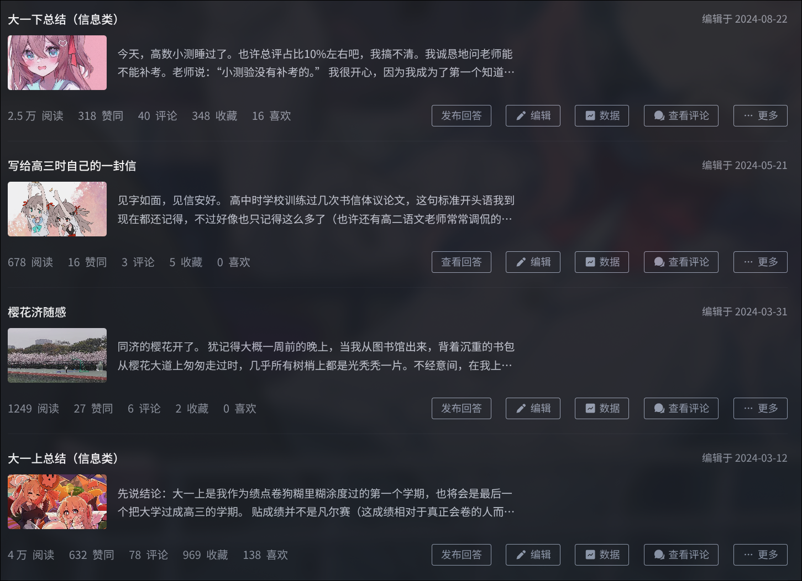

# 2025-08-27

我特意把这篇无营养的自述文章放在了最底下，如果你愿意翻到这里并点开，我想你愿意听我废话的几率应该会大一些。

谢谢你。

---

已经一年多没有写过长文总结了，上次在知乎“文章”板块的创作，还是去年8月。

这一年过去，愈来愈觉得文思匮乏、黔驴技穷，无论学习生活还是人际都在全线败退，实在没什么可记录的。

可笑的是我的粉丝还在不停增长，6月发了一次拍的很一般的女装照之后甚至一天涨了60个粉丝（虽然后来又拍了一点更好看的）。

关注我干嘛呀，有那么多比我更牛逼的人，我算个寄吧。也许他们是把我当赛博宠物养？那也挺好。

---

回顾一下已经过去的两年、四学期吧，只是简单回顾。

大一上大概是我大学时期，在**当时**看来最为清醒、最有目标和动力、也最有收获的一段时期。彼时的我刚上大学，高中三年衡水模式带来的“自律”习惯，让我能够做到几乎每天8:00到图书馆（如果早八没课的话；即使早十有课我也会去图书馆先学会）、晚上22:30离馆，全天维持十多个小时高效学习。我甚至会预习高数课本、做课后题和吉米多维奇，在期中期末考试前至少一个月就会开始系统复习每个考试科目，就像高三做的n轮复习那样。我依然不屑于文科，完全不把3学分的思修放在眼里（有30%的日常发言分，我应该被扣了不少，因为我几乎从不发言），就像我对高中语文得过且过一样。我几乎把所有周末都留给了图书馆，不是在刷题就是在“自学”（比如d2l，dive into deep learning）或者“做项目”（其实只是调调工具玩玩整合包，自己几乎没写过什么代码，只是看书学了一些python）。那时的我真是感觉又充实又快乐，现在看来只是有种混沌未开、自我陶醉、自以为自得其乐的愚蠢。期末出成绩后，我发现自己除了一些所谓的“水课”以外，“重要的主课”基本全是优，总绩点是4.74。我对那些给我拖分的思修、大物实验一类“垃圾课”不屑一顾，对自己4.7+的绩点沾沾自喜（当时排在年级60名左右），殊不知这种得过且过与自虐般的“努力”，只会带来未来高不成低不就、上不去下不来卡在中间一败涂地的苦果。

[大一上总结（信息类） - NotRealName的文章 - 知乎](https://zhuanlan.zhihu.com/p/678841483)

---

大一下，课程开始上强度，高程一大堆作业，电路理论也听不懂，其他的硬课也是一门不少。这一学期认识了更多的人，有至今常有来往且对我十分重要的（^_^），有曾经无话不谈但如今越走越远的（我想，大概是怪我逐渐堕落了吧），也有很多加了好友之后就几乎再无联系的。因为课业压力陡然增大，这一学期更是几乎没有任何休息时间，所有能检索到的记忆都是自己的VS2022和别人的VS2022那黑白底色深紫边框的压抑界面。我想不到这学期有什么可写的，也懒得回忆了，总之，这学期过的十分痛苦，最终绩点也很烂，甚至4都没到，虽然没有影响分流，但也基本让我与保研无缘。

[大一下总结（信息类） - NotRealName的文章 - 知乎](https://zhuanlan.zhihu.com/p/705836149)

---

可悲的是，我在大二上还对自己的绩点抱有奢望，企图好好学习提高一下类内排名，这导致我又痛苦地过了一个学期。数字逻辑是丝毫不想学的，离散数学是令人恶心的，数据结构刷题也是寸步难行，OOP同样也是占用大量时间还学不好的（高程起码是双优，OOP是良，并且作业的AI成分更大了。关于AI，我后续还会再谈）。说实话让我回想自己的大二上学期，我甚至回想不起来除了同样整天写那堆没什么用的破大作业，以及整天被算法题折磨以外还做了什么。我就是很菜啊，我应该也就是不适合学计算机吧，但我除了学这玩意以外还能学啥呢？

大二上开始就没有总结了，只写了一篇强烈自嘲的回答。[做一个985废物是什么感觉？ - NotRealName的回答 - 知乎](https://www.zhihu.com/answer/72298269257)

也是从此开始我认识到自己可以彻底退出绩点竞争体系了，下学期直接开摆。

---

大二下。刚过完的一个学期。

我确实是贯彻落实了得过且过、随心开摆的计划，但这也并没给我带来多少快乐。我在这一学期内和朋友出去吃了n多次饭，比我前一年半所有社交都多；和朋友在一起的时候固然是快乐的，但不影响回学校之后继续自怨自艾。我逃的课开始变多，用AI糊弄的频率也是越来越高，当然自学的东西也确实更多了一些（但是，也无非是走马观花……）。4月的时候我把SITP退了，因为实在是力不从心：没资源、没人脉、没水平。更糟的是SITP让我对科研都有些畏惧了……从3月到6月，精神状况越来越糟糕，想法也越来越极端，课内学习进度只能勉强维系，更别提什么其他的科研、项目和竞赛了。

[人恐惧症？ - NotRealName的想法 - 知乎](https://www.zhihu.com/pin/1899475130066933677)

[2025 04-05 近况 - NotRealName的想法 - 知乎](https://www.zhihu.com/pin/1902841002538022746)

大二下结束之后，我早已无力复盘自己这一学期了。大学两年四学期，越过越糟糕，越过越糊涂。我不知道自己为什么会这样，可能本来就不喜欢敲代码，加上探索精神与坚持不懈精神之匮乏，以及智力（我必须承认，我不是聪明人，而且跟很多人比我就是个傻逼）、心力（也许可以把锅推给衡中三年？）的双重缺陷，最终我就这么落得一个绩点竞赛科研实习一事无成、浑浑噩噩度日的局面。

---

能说我什么都没学吗？似乎也不能。

**大一上**：

- 看书学了点python，没写项目，只记笔记（用Xmind思维导图——那些导图文件已经伴随着前几天重装系统一并丢失了，哈哈），事实证明学语言不敲代码就是p用没有、自欺欺人，让你以为自己学了很多东西，其实毛都没剩下；
- 同样是看书学了点d2l，把代码下载下来了跟着跑了跑，奈何深度学习对一个高数基础都没有的人实在是太难，d2l没看多久就放弃了；
- 做AI歌手：这个纯粹浪费时间，搞搞sovits就算了，姑且还算能提升一点工程能力，但学习用那些音乐领域的专业软件，比如izotope RX10, RipX之类的，有啥用？想干啥？想走艺术路线吗？乐理都不懂你就想搞AI音乐？
- 进社团（播音社，也涉及到一些拍摄的活动）：更是浪费时间，没那个艺术细胞

**大一下**：

- SITP：科研入门，收获比较多，基本把实际动手写论文前的流程都跑了一遍；python环境、git、论文搜集、笔记、总结、汇报，等等。
- GPT-Sovits, TTS：用前者训练了Neuro && Evil的语音模型，过程中学习了大量python环境的实践知识，比较有用，但也是浅尝辄止
- 初步接触LLM，伴随SITP一起读论文学理论
- 算是认真的完成了高程全部作业，C++基础还算牢固

**大二上**：

- 跟一个好朋友一起做了一个Deep Learning的读书笔记项目，认识了目前学院导师（但并未进组）
- 探索有关多模态LLM / MoE的内容，主要是想做自己的Neuro-sama（整个寒假基本都浪费在探索LLM相关方向上了，没深入学），但现在也已经放弃
- 受另一个朋友影响，开始学习Web，前端三件套（只是了解，没深入学框架）
- 打了一次ctf，基本全靠AI，也没啥实际收获，最终当然是半途而废

**大二下**：

- 学习CMU15-445，半途而废，没做项目，甚至连课都没听完
- 学习CS50-AI，作为课内人工智能课程的辅助，同样没怎么做项目，基本也白搭
- 继续深入学习LLM，理论方面看了一本国产的入门书，质量一般；应用方面，看了看RAG；这一年内LLM发展速度太快了，我也确实学了不少浅层的东西，尽量保持不掉队
- 继续学习Web，搭建了个人博客，买了域名和服务器，部署了一点没人看没人用的破烂玩意
- 学了几天rust，后来开始忙了，遂放弃
- 对Docker更加熟练，试图翻译官方文档，后放弃
- 对Linux更加熟练，暑假试图安装LFS，因为中途发现搞错了gcc版本（纸质书坑死我了，版本不是最新的，有一堆报错和需要我手动解决的补丁；必须看网页版才是最新的），担心后续不兼容问题滚雪球，越积越多，遂同样放弃。本来还想自己整理LFS自动化安装脚本的，不过后来看了眼官网，似乎是有……

没了，就这些。

啥都涉及了一点，结果啥都不精，没有核心竞争力。AI Assistant Coding更是严重摧毁了我的编码能力，Debug靠AI，虽说我基本也能看得懂报错消息，也有一些解决报错的“直觉”；编码更是逃不开AI，算法是不会的，软件工程范式是不会的，纯靠Prompt工程。绩点是没有的，竞赛是不参加的（数模，自己打一次，无奖；别人邀请打一次，三个人甚至直接弃赛；其他比赛就没了：我这菜逼甚至没打过程序设计/算法竞赛），科研是没有/半途而废的，实习更是没有的。

今年六月的时候，莫名其妙就想开始女装当cross-dresser了（可能也是某位朋友一语成谶了），因为我觉得女装似乎能让我感到放松。那就穿呗，准备了全套衣服，到学校外面住了一天，拍很多照，也确实开心了。但很快，就又得滚回学校面对灰暗现实了对不对？那我就想方设法逃避现实吧（我真对本校学生没有任何好感）。我加了一些校外的交流群，群里有很多大佬，平时看看他们在说什么；在交流群里还认识了一个小药娘，又通过他继续深入男娘和药娘的圈子。我后来自己也买了新衣服，三套，带酒店去穿。穿的过程中也能感受到自己在离所谓的“正常人”越来越远，离雌堕（无性别歧视之意，只是大家似乎都这么说，就像我以为ftm愿意的话也可以叫雄堕）这种“非正常人”越来越近。

那我能怎么办？我其实自己并不在意，当下开心就好。我大抵是已经活够了，现在只是在为了以后照顾亲人、为了不要死在他们前面让他们难受，靠惯性活着。我也没什么在意的人和事物，首要目标是先找顾好自己，与自己和解。我尝试过自伤但不敢真去死，有点躯体化症状但不多（我都怀疑“躯体化”就是我为了说服自己去看医生编纂出的幻想与借口），下定决心去医院看了下医生，带回来几板奥氮平和几瓶草酸，真到吃药的时候感觉好像自己其实并没有什么病，只是莫名其妙找不到乐趣、思维陷入死胡同了。

我已经拿自己没办法了。

快两个月了，药没再吃，好像也没什么事。如果开学之后状态不好，再去拜访宛平南路600应该就比较方便了（虽然不一定有用），毕竟是复诊号。

当前的首要任务就是活着，然后才是有质量地活着。

现在是凌晨三点，老家卧室，窗外大雨瓢泼。

好想永远留住这一刻。

> 2025-08-27 03:01:00